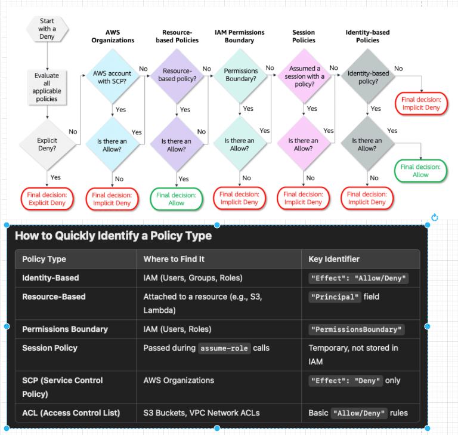
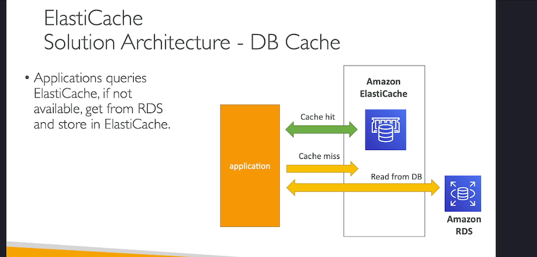
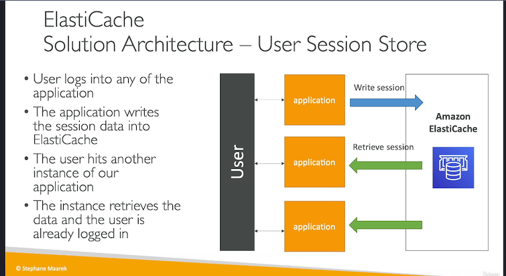

# AWS Solutions Architect Associate Notes

Study material
1. exam guide : https://d1.awsstatic.com/training-and-certification/docs-sa-assoc/AWS-Certified-Solutions-Architect-Associate_Exam-Guide.pdf
2. Stefan Marek's AWS Certified Solutions Architect Associate course on Udemy
3. AWS Skill builder.
4. Whiz labs AWS Certified Solutions Architect Associate tests
5. AWS white papers and website documentation.

## Table of Contents
1. <a href="#introduction">Introduction</a>
2. <a href="#identity-access-management-iam">Identity Access Management (IAM)</a>
3. <a href="#EC2">Elastic Cloud Compute EC2</a>
4. <a href="#EBS-volume">EBS volume</a>
5. <a href="#High-Availability-and-Scalability-ELB-and-ASG">High Availability and Scalability ELB and ASG</a>
6. <a href="#RDS-Aurora-ElastiCache">RDS Aurora ElastiCache</a>
7. <a href="#Route-53">Route 53</a>
8. <a href="#Amazon-S3-and-other-storage-services">Amazon S3 and other storage services</a>
9. <a href="#CloudFront-and-AWS-Global-Accelerator">CloudFront and AWS Global Accelerator</a>


## Introduction
TODO

## Identity Access Management (IAM)
<details>
<summary> Q: what is Users, Groups, Roles, and Policies? IMP - remember role is HAT/CAP which can be put on group or users</summary>

Users: Assigned credentials (username/password, access keys). <br>
Groups: Users are added to groups (e.g., "Developers"), and policies are attached to groups. <br>
Roles: Assigned to AWS services (like EC2) or users temporarily. Policies are attached to roles. <Br>
Policies: JSON documents that define permissions. They are not standalone identities – they must be attached to a User, Group, or Role. <br>

IAM roles provide temporary credentials (access key, secret key, and token) when assumed, replacing long-term access keys. <br>
<span class="highlighted-text"> Role is like hat, which is being wear by user or service to perform certain tasks.</span> <br>
These credentials are short-lived and used by users, apps, or AWS services to perform tasks securely. <br>
Example reference link : https://www.youtube.com/watch?v=miij_0HkBws <br>
</details>

<details>
<summary>Q: What are policies and what are the types of policies ?</summary>
Policies are JSON documents defining permissions for users (IAM) or resources (S3, Lambda).

simple policy example below : <br>
(Allows listing objects in example_bucket only if the prefix is "home/")

```json
{
    "Version": "2012-10-17",
    "Statement": [
        {
            "Effect": "Allow",
            "Action": "s3:ListBucket",
            "Resource": "arn:aws:s3:::example_bucket",
            "Condition": {
                "StringEquals": {
                    "s3:prefix": "home/"
                }
            }
        }
    ]
}
```
Policies have below elements :
- version - Version of the policy language
- id - Policy ID **(optional)**
- statement - List of statements
    - sid - Statement ID **(optional)**
    - Effect - whether the statement allows or denies access
    - Principal - account/user/role to which policy is attached to
    - Action - List of actions that are allowed or denied
    - Resource - List of resources to which the action is applied to
    - Condition - Condition when the policy is in effect **(optional)**

#### There are 6 types of policies all of these polices are evaluated before a request is either allowed or denied.

#### 6 Policy Types
**Identity-Based Policies**  
Attached to users/groups/roles.  
*Example:* AmazonS3FullAccess policy lets a user (e.g., "Alice") manage S3.

**Resource-Based Policies**  
Attached to resources (S3, Lambda).  
*Example:* S3 bucket policy allowing another account to read objects.

**Permissions Boundaries**  
Set max permissions for a user/role.  
*Example:* Boundary allowing only s3:GetObject, even if other policies grant more.

**Session Policies**  
Temporary permissions for role sessions.  
*Example:* Assume a role with STS, limiting actions to s3:ListBucket for 1 hour.

**Service Control Policies (SCPs)**  
AWS Organizations guardrails.  
*Example:* Block s3:DeleteBucket across all accounts in an OU.

**ACLs**  
Legacy resource access rules.  
*Example:* S3 object ACL set to public-read for open access.

Below is the flow in which these policies are evaluated before a request is either allowed or denied.
. <br>
</details>

<details>
<summary>Q: Two types of authorization model RBAC and ABAC what they are and difference between them?</summary>
IMP - Recognize when to use ABAC (tags, scaling) vs. RBAC (static roles). Always check for aws:ResourceTag or aws:PrincipalTag in policies.
Both are IAM strategies to manage permissions, but they work differently. Let’s break them down with simple examples and exam-focused insights.

### 1. RBAC (Role-Based Access Control)

**Definition:** Assign permissions based on predefined roles (e.g., "Admin," "Developer").

**How It Works:**

- Create IAM roles with policies that specify exact AWS resources (e.g., S3 buckets, EC2 instances).
- Users/groups are assigned these roles.

**Example:**

**Scenario:** A company has two S3 buckets: `projectx-data` and `projecty-data`.

**Role:** `ProjectX-Developer`

**Policy:** Allows read/write access only to `projectx-data`.

```json
{
    "Version": "2012-10-17",
    "Statement": [
        {
            "Effect": "Allow",
            "Action": ["s3:*"],
            "Resource": [
                "arn:aws:s3:::projectx-data",
                "arn:aws:s3:::projectx-data/*"
            ]
        }
    ]
}
```

Exam Tip:
RBAC is ideal for static environments where resources don’t change often.
If a new bucket projectz-data is added, you must update the policy to include it.

### 2. ABAC (Attribute-Based Access Control)

**Definition:** Permissions are based on tags (attributes) attached to users/resources.

**How It Works:**

- Define policies that use conditions like `aws:ResourceTag` or `aws:PrincipalTag`.
- Access is granted if tags match.

**Example:**

**Scenario:** Developers should only access EC2 instances tagged with their team’s name (e.g., Team=Frontend).

- **User Tag:** `Team=Frontend` (assigned to the IAM user).
- **Resource Tag:** `Team=Frontend` (assigned to EC2 instances).

**ABAC Policy:**

```json
{
    "Version": "2012-10-17",
    "Statement": [
        {
            "Effect": "Allow",
            "Action": "ec2:*",
            "Resource": "*",
            "Condition": {
                "StringEquals": {
                    "aws:ResourceTag/Team": "${aws:PrincipalTag/Team}"
                }
            }
        }
    ]
}
```
**Exam Tip:**  
ABAC is scalable for dynamic environments (e.g., auto-scaling EC2 instances). No policy updates needed when new resources are created—just apply the correct tags.

**Key Differences for the Exam:**

| **RBAC** | **ABAC** |
|----------|----------|
| Permissions tied to roles with explicit resource ARNs. | Permissions tied to tags on users/resources. |
| Best for fixed, predictable resources. | Best for dynamic, rapidly changing resources. |
| Requires policy updates for new resources. | Automatically applies to new tagged resources. |

</details>

## EC2

<details> <summary>🎯Q: EC2 Placement Groups types and use cases?</summary>

- `Cluster`: Instances are grouped into a single Availability Zone (AZ) for ⭐low latency.⭐
  - PRO : low latency, high performance.
  - limitation : If AZ fails, all instances fail.

- `Spread`: Instances are spread across distinct hardware (max 7 instances per AZ) for fault tolerance. 
  - here each EC2 instance is on different hardware(⭐even when its in same AZ⭐) and in different AZs as well.
  - PRO : fault tolerance.
  - limitation : limited to 7 instances per AZ.
  - **UseCase** : critical applications, where each instance must be isolated from failure from each other.
  
- `Partition`: Instances are divided into partitions, each isolated from failures (used for large distributed systems like Hadoop).
   - Same Availability Zone (AZ): All instances within a partition placement group are in the same AZ.
   - Same Region: All instances within a partition placement group are in the same AWS region.
   - Isolation: Each partition is isolated from the failures of other partitions, providing fault tolerance.
   - 

- `cluster` is single AZ, `spread` is multiple AZs, `partition` is multiple AZs and multiple regions.

Simple real-world example for end-to-end visualization: ⭐

- Cluster: A high-performance computing (HPC) workload requiring fast communication between instances (e.g., financial modeling).
- Spread: Hosting mission-critical applications (e.g., healthcare systems) where downtime is unacceptable.
- Partition: A distributed database (e.g., Cassandra) where partitions ensure failure isolation.

Exam Cheat Sheet ⭐

| Type | Best For | AZs | Failure Risk |
|------|-----------|-----|--------------|
| Cluster | Speed (HPC, gaming) | Single AZ | Entire group if rack fails |
| Spread | Critical small apps | Multiple AZs | Only 1 instance per failure |
| Partition | Big data (Hadoop) | Multiple AZs | Only 1 partition (subset of nodes) |

Brain Hack for Exam⭐
- Cluster = "Cram together" → Speed.
- Spread = "Spread out" → Safety.
- Partition = "Divide and conquer" → Scale + Partial safety.


Exam Tip:

- "Low latency" → Cluster
- "Fault tolerance" → Spread
-  "Large distributed apps"  → Partition

</details>

<details>
<summary>🎯Q: Different instances types in EC2 ?</summary>
Instance Types:

- `General-purpose` (e.g., T3, M6g) for balanced workloads.
- `Compute-optimized` (e.g., C5) for CPU-intensive tasks.
- `Memory-optimized` (e.g., R5) for in-memory databases.
</details>


<details>
<summary>🎯Q. What is the ENI and why it's used? </summary>

- An Elastic Network Interface (ENI) is a virtual network interface that enables communication between an Amazon EC2 instance and other AWS resources or on-premises networks. 
- It provides network connectivity, IP addresses (IPv4/IPv6), security groups, and MAC addresses to instances.

**what is attached to the network interface?**
** Security groups, public IP, Elastic IP, private IP,and MAC address. <br>
MAC address means Media Access Control address, which is a unique identifier assigned to network interfaces for communications on the physical network segment. <br>

**Why and When It Is Used:**
- **High Availability:** You can attach multiple ENIs to an EC2 instance, each in a different subnet, to ensure redundancy.
- **Network Segmentation:** ENIs allow you to separate traffic types (e.g., management vs. data traffic) by attaching multiple interfaces to a single instance.
- **Failover Scenarios:** ENIs can be moved between instances to quickly recover from failures.

**Exam Tips:**
**Key Points:**
- ENIs are ⭐bound to a specific Availability Zone (AZ) and cannot be moved across AZs⭐.
- You can attach multiple ENIs to an instance, depending on the instance type.
- ⭐ENIs retain their attributes (e.g., private IPs, MAC addresses) when detached and reattached to another instance.⭐
- ENIs are useful for creating ⭐dual-homed instances⭐ (e.g., instances with public and private IPs).

**Common Mistakes:**
- Forgetting that ENIs are AZ-specific.
- Overlooking the fact that ENIs ⭐can have multiple private IPs and one public IP⭐.
- Confusing ENIs with Elastic IPs (EIPs), which are public IPs that can be remapped.
</details>


<details>
<summary>🎯Q. What is EC2 hibernate and use of it? scenarios ?</summary>

- It Pauses an EC2 instance and saves its in-memory state (RAM) to the root EBS volume, allowing it to resume later from the exact state. 


what is use of hibernation ? <br>
- Save time by preserving the RAM state.
- Resume instances faster than booting from scratch.
- Ideal for long-running applications that need to be paused and resumed quickly. <br>

**Key Prerequisites:**
- ⭐Encrypted root EBS volume (mandatory).⭐
- RAM ≤ EBS root volume size (e.g., 16 GiB RAM → root volume ≥ 16 GiB).
- Supported instance families: M5, C5, R5, T3 (not all instance types).

**Hibernate vs. Stop:**
- **Stop:** ⭐Terminates RAM state;⭐ starts fresh on next launch.
- **Hibernate:** ⭐Preserves RAM state;⭐ resumes processes.
</details>


## EBS volume
<details>
<summary>Q: What is EBS volume and its use?</summary>

- **EBS volumes** are like USB sticks for EC2, providing persistent block storage. 
- They remain intact even after the associated EC2 instance is terminated. 
- EBS volumes can be ⭐dynamically attached to or detached from EC2 instances⭐, allowing for flexible storage management.
- **Per AZ:** EBS volumes are specific to an Availability Zone.
- **Attachment:** Can be mounted to multiple EC2 instances but attached to only one instance at a time.

### Exam Tips:
- **Incremental Nature of Snapshots:** Understand that EBS snapshots are incremental. After the initial snapshot, only the changed data blocks are stored in subsequent snapshots.
- **Data Restoration:** When restoring a volume from a snapshot, the new volume will be an exact replica of the original volume at the time the snapshot was taken.
- **Cross-Region and Cross-Account Sharing:** EBS snapshots can be copied across regions and shared between AWS accounts, facilitating data migration and disaster recovery strategies.
- **Cost Considerations:** ⭐Since snapshots are stored incrementally, they are cost-effective⭐. However, it's essential to manage and delete unnecessary snapshots to avoid accruing storage costs.
</details>

<details>
<summary>🎯Q . what are different EBS volume types</summary>

**1. General Purpose SSD (gp2) and (gp3)**
- **Use Case:** Boot volumes, virtual desktops, dev and test environments.

**2. Provisioned IOPS SSD (io1) and (io2)**
- **Use Case:** Critical business applications, large databases, I/O-intensive workloads.

**3. Throughput Optimized HDD (st1)**
- **Use Case:** Big data, data warehousing, log processing.

**4. Cold HDD (sc1)**
- **Use Case:** Infrequently accessed data, lower cost storage.

**5. Magnetic (standard)**
- **Use Case:** Previous generation, low-cost storage for infrequently accessed data.
</details>


<details>
<summary>🎯Q: What is the multi-attach feature?</summary>

- Allows a single EBS volume to be attached to multiple EC2 instances within the same AZ. 
- Each instance can read and write data to the volume simultaneously.

**Use Cases:**
- Shared file systems
- Clustered databases
- Applications requiring high availability

Exam Tips: ⭐
- Multi-Attach is only supported for io1 and io2 volume types.
- All instances must be in the ⭐same Availability Zone⭐
- Ideal for clustered workloads like databases (e.g., Oracle RAC, SQL Server Failover Cluster).
- Not supported for boot volumes—only for data volumes.
- Use Multi-Attach for high availability and low-latency shared storage scenarios.

Common Mistakes: ⚠️
- Assuming Multi-Attach works with all EBS volume types (it’s only for io1/io2).
- Trying to attach the volume to instances in different Availability Zones.
- Using Multi-Attach for boot volumes (it’s not supported).

**Key Points:**
- Application must be designed to handle concurrent writes to the volume.
- Up to 16 instances can be attached to a single volume.

</details>

<details>
<summary>🎯Q. Explain EC2 instance store</summary>

- **EC2 Instance Store** provides temporary block-level storage for EC2 instances.
- If an EC2 instance store stops or terminates, data is lost.
- **Best for:** Buffer, cache, scratch data, temporary content
- **Ideal for:** Low latency, high performance applications

**Example Use Case:**  
A machine learning job processing large datasets where temporary storage is needed to handle intermediate data and the results are later saved to persistent storage (like EBS or S3).

**Exam Tips:**

- **Ephemeral Nature:** EC2 Instance Store is temporary and not persistent. Data is lost when the instance is stopped or terminated, so it should only be used for non-critical, transient data.
- **Not All Instance Types Support It:** Not all EC2 instance types come with instance store volumes. You must select instance types that provide instance store support (e.g., i3, d2, r5d).
- **Cost-effective for Temporary Storage:** Instance stores are typically more cost-effective for workloads needing high-throughput but not requiring data persistence.
- **Common Mistake:** Confusing instance store with persistent storage options like EBS or S3. Instance store is only suitable for ephemeral storage needs.
</details>
<details>


<summary>🎯Q: What is Amazon EFS - Elastic File System?</summary>
**Amazon EFS** is a managed NFS (Network File System) that can be shared across thousands of EC2 instances.

**Use Cases:**
- Content management
- Web serving
- Data sharing
- Container storage

**Key Features:**
- Scalable, elastic, highly available, and durable
- Uses security groups to control access to the file system
- Only for Linux-based instances (for Windows, there is a separate file system by AWS)
- No need for capacity planning as it scales automatically (recommended option)
</details>


<details>
<summary>🎯Q. EFS vs EBS, use case and exam tips</summary>
**Example Use Case:**
**EFS:**
- Used for applications like content management systems (CMS), big data analytics, or media workflows where multiple EC2 instances need concurrent access to the same data.
- **Example:** A web application with several EC2 instances running web servers that need access to shared media files, such as images or videos.

**EBS:**
- Ideal for applications needing persistent block storage that is attached to a single instance, such as a database or transactional systems.
- **Example:** A database hosted on EC2, where the data must be persistent and only needs to be accessed by one EC2 instance at a time.

**Exam Tips:**

**EFS Key Points:**
- Shared file storage for multiple EC2 instances.
- Uses NFS protocol and supports Linux-based instances.
- Automatically scales as data grows.
- Ideal for distributed applications and content sharing across EC2 instances.

**EBS Key Points:**
- Block storage that can be attached to a single EC2 instance.
- Ideal for databases, transactional applications, or any workloads requiring persistent storage.
- EBS volumes persist even when the EC2 instance is stopped, unlike EFS, which supports multiple simultaneous mounts.

**Common Mistakes:**
- **EFS vs. EBS for shared access:** EFS is the right choice for shared data access across multiple instances. EBS is not designed for multiple instances.
- **Mounting EBS on multiple instances:** EBS volumes can only be mounted on one EC2 instance at a time (except for EBS Multi-Attach, which has limited support).
</details>


<details>
<summary>🎯Q: Why is the "Delete On Termination" attribute enabled by default for the root volume but disabled for other EBS volumes?</summary>

**Root Volume:**
- **Reason:** The root volume contains the operating system and is essential for the instance to boot. When an instance is terminated, it is often desirable to delete the root volume to avoid unnecessary storage costs and to ensure that the instance is completely removed.
- **Default Behavior:** Enabled by default to automatically clean up the root volume when the instance is terminated.

**Other EBS Volumes:**
- **Reason:** Additional EBS volumes are often used to store important data that may need to persist beyond the lifecycle of the instance. Automatically deleting these volumes could result in data loss.
- **Default Behavior:** Disabled by default to ensure that data stored on these volumes is preserved even if the instance is terminated.
</details>

<details>
<summary>🎯Q: Can you launch an EC2 instance using an AMI from another AWS Region?</summary>

**Answer:** No, you cannot directly launch an EC2 instance using an AMI from another AWS Region. ⭐AMIs are unique to each AWS Region.⭐

**Solution:** You can copy the AMI to the target AWS Region and then use it to create your EC2 instances.
</details>

## High Availability and Scalability ELB and ASG
- High Availability (HA) ensures your application remains operational even if components fail,
- Scalability ensures your application can handle increased load by adding resources.

<details>
<summary>what is scale-up and scale-down and scale-out and scale-in means ?</summary>
This is a key concept in cloud computing and is often tested in the exam.
`Scalability`: The ability to increase or decrease resources based on demand. <br>
`vertical scaling is scale-up and horizontal scaling is scale-out`. <br>
Scale-up: Increasing the size of an instance (e.g., upgrading from t2.micro to t2.large). <br>
Scale-down: Decreasing the size of an instance (e.g., downgrading from m5.xlarge to t3.medium). <br>
Scale-out: Adding more instances to distribute the load. <br>
Scale-in: Removing instances to reduce the load. <br>
</details>


<details>
<summary>🎯 Q. what are the types of the load balancer?</summary>
Load Balancer : it's a service that distributes incoming application or network traffic across multiple targets, such as EC2 instances, containers, and IP addresses, in multiple Availability Zones. <br>
-its per region service. <br>

Types of load balancer (4 types):
1. Application Load Balancer (ALB) : Layer 7, HTTP/HTTPS, intelligent routing, and microservices.
   - supports HTTP2 and websocket. 
   -  routing to different target groups based on URL, hostname and query string headers
   - `supports containerized applications and microservices`
2. Network Load Balancer (NLB) : Layer 4, TCP/UDP, high performance, and static IP. <br>
    - Forward TCP and UDP traffic to your instances.
    - handle millions of requests per second.
    - ⭐ **`NLP has one static IP per AZ and supports assigning Elastic IP address`**
    - Target groups can be EC2 instances, IP addresses (must be private) and ⭐Application Load Balancers.
3. Gateway Load Balancer : Deploy, scale, and manage third-party virtual appliances. <br>
    - Deploy, scale, and manage third-party virtual appliances such as firewalls, intrusion detection and prevention systems, and deep packet inspection systems in the cloud.
    - Uses the GENEVE on port 6081 protocol to encapsulate and forward traffic to virtual appliances.
4. Classic Load Balancer : Legacy, Layer 4/7, HTTP/HTTPS, and TCP. <br>
</details>

<details>
<summary>🎯Q. what is Sticky Sessions(Session Affinity) </summary>
Sticky Sessions (Session Affinity): Ensures that a client's requests are always directed to the same target. <br>
2 types <br>
    - Load balancer-generated cookie: The load balancer generates a cookie to track the session. <br>
    - Application-generated cookie: The application generates a cookie to track the session. <br>
</details>

<details>
<summary>🎯Q. what is cross zone balancing ? </summary>
Cross-Zone Load Balancing is a feature of AWS Elastic Load Balancers (ELBs) that distributes incoming traffic ⭐evenly⭐ across all registered instances in all Availability Zones (AZs) within a region. 
This ensures that no single AZ is overwhelmed with traffic while others remain underutilized. <br>
Know that cross-zone load balancing is ⭐enabled by default for Application Load Balancers but needs to be manually enabled for Network Load Balancers.⭐
</details>


<details>
<summary>🎯🔥Q. what is Auto Scaling group? what are scaling policies ?</summary>

**Definition:** Is a service that automatically adjusts the number of instances in a group based on demand or a predefined schedule. <br>
- **Scale-out:** Increase the number of instances based on demand. <br>
- **Scale-in:** Decrease the number of instances based on demand. <br>
- **Automatically replaces unhealthy instances** and also registers new instances to the load balancer.
- Minimum capacity : always running instances
- Desired capacity : Target number of instances
- Maximum capacity : Maximum number of instances that can be running. <br>

<details>
<summary>Example scenarios to understand desired capacity below</summary>
Example Scenario 1: E-commerce Website

Minimum Capacity: 3 instances
Maximum Capacity: 10 instances
Desired Capacity: 5 instances
Explanation:

The ASG will always keep at least 3 instances running to handle basic traffic.
It can scale up to a maximum of 10 instances if needed.
The ASG aims to maintain 5 instances under normal load. If traffic increases, it might scale out to 7 or 8 instances until the load decreases, at which point it will scale back down to 5.
Example Scenario 2: Seasonal Application

Minimum Capacity: 2 instances
Maximum Capacity: 15 instances
Desired Capacity: 10 instances
Explanation:

During peak season, the application typically needs 10 instances to handle traffic.
The ASG starts with 2 instances running (minimum).
As traffic increases, it scales up to reach the desired capacity of 10. If traffic spikes even more, it can scale up to the maximum of 15 instances.
Example Scenario 3: Fluctuating Workload

Minimum Capacity: 1 instance
Maximum Capacity: 5 instances
Desired Capacity: 1 instance
Explanation:

The application has low traffic most of the time, so it starts with a desired capacity of 1 instance.
If traffic increases, the ASG can scale up to 5 instances if needed, but it will try to maintain 1 instance during low traffic periods.
If traffic drops, it will scale down to the minimum of 1 instance.
Key Takeaway

Desired Capacity is the target number of instances the ASG tries to maintain based on current load. It can change dynamically based on traffic, but it will always respect the minimum and maximum capacities set for the ASG.
</details>

**Understand scaling policies:** ⭐
- **Target Tracking:** Automatically adjusts the number of instances to maintain a target metric (e.g., CPU utilization).
- **Step Scaling:** Scales based on predefined thresholds (e.g., scale out if CPU > 70%).
- **Simple Scaling:** Manually adjusts the number of instances based on a single scaling adjustment.
- **Scheduled Scaling:** Scales based on a schedule (e.g., scale out during peak hours, specify the time).

**Exam Tips:** ⭐
- `Understand Scaling Policies`: Focus on Target Tracking and Step Scaling, as they are commonly tested.
- `Multi-AZ Deployment`: Always configure ASGs across multiple Availability Zones (AZs) for high availability.
- `Health Checks`: Ensure ASG integrates with Elastic Load Balancer (ELB) health checks for instance health monitoring.

**Common Mistakes:** ⚠️
- Not Defining Minimum/Maximum Capacity: Failing to set these can lead to excessive costs or insufficient resources.
- Ignoring Cooldown Periods: Not configuring cooldown periods can result in rapid scaling actions, causing instability.
- ⭐Overlooking Instance Termination Policies⭐: Not setting termination policies can lead to unintended instance removal. <br>
  ⭐Termination policies determine which instances to terminate when scaling in (removing instances) in an Auto Scaling Group. here are common termination policies:⭐
  - Default Policy: AWS chooses the instance with the oldest launch configuration or template.
  - Newest Instances: Prioritizes terminating the most recently launched instances.
  - Lowest Cost: Chooses instances based on cost metrics, such as Spot Instances.
  - Health Status: Terminates unhealthy instances first.
  - Availability Zone Balance: Ensures balanced instance distribution across Availability Zones.
</details>

<details>
<summary>🎯🔥 Q. Load Balancer, Target Group and Auto Scaling Group how they are related to each other? </summary>

`Load Balancer (LB)`: Distributes incoming traffic across multiple targets (e.g., EC2 instances).
`Target Group (TG)`: Routes requests to registered targets (instances/lambda) via rules. LB directs traffic to TGs.
`Auto Scaling Group (ASG)`: Automatically adjusts EC2 capacity based on demand. Launches/terminates instances.
 ⭐`Relation` ⭐: ASG scales instances, registers them to a TG, and LB routes traffic to the TG.<br>

⭐ Exam Tips: ⭐
- ASG + LB = High availability + scalability.
- Target Groups decouple LB from instances (e.g., LB can route to different TGs).
- Scaling policies prioritize ⭐Desired first⭐, then adjust within min/max. This means that the ASG will always try to maintain the Desired Capacity, but it can scale up to the Maximum Capacity if needed.


Common Mistakes: ⚠️
- Forgetting to link ASG to a TG (traffic won’t reach scaled instances). - ⭐means ASG should be linked to TG and TG should be linked to LB⭐.
- Setting min ≥ max or desired outside min/max range.
- Confusing LB health checks (for traffic routing) with ASG health checks (for instance replacement).- means ⭐LB health checks are for routing traffic and ASG health checks are for instance replacement.⭐
</details>


🎯 ⭐One liners notes⭐ 🎯
- Only Network Load Balancer provides both ⭐static DNS name and static IP⭐. While, Application Load Balancer provides a static DNS name, but it does NOT provide a static IP 🚫or even also not provide a way to attach elastic IP.🚫
- To get the client's IP address to application code, ALB adds an `X-Forwarded-For header` to the request., `X-forarded-port`-for client's port number, `X-forarded-proto`-for client's protocol.
- `network load balancer` cannot be a target in target groups however `application load balancer` can be a target in target groups.
- Server Name Indication (SNI) allows you to expose multiple HTTPS applications each with its own SSL certificate on the same listener.
- ⭐You can configure the Auto Scaling Group to determine the EC2 instance's health based on Application Load Balancer Health Checks instead of EC2 Status Checks (default)⭐. When an EC2 instance fails the ALB Health Checks, it is marked unhealthy and will be terminated while the ASG launches a new EC2 instance.
- The NLB supports HTTP health checks as well as TCP and HTTPS


## RDS Aurora ElastiCache
<details>
<summary>🎯Q. What are advantages of using RDS(relational database service) instead DB in the EC2 ?</summary>

- it's a managed service which provides automated provisioning, backups, patching, monitoring, and scaling of databases.
- provides multi-AZ setup for Disaster Recovery.
- it's a managed service which provides automated provisioning, backups, patching, monitoring, and scaling of databases.
- provides multi-AZ setup for Disaster Recovery.
- automated backups with point-in-time recovery (up to 35 days).
- monitoring dashboards with CloudWatch.
- storage backed by EBS (gp2 or io1).
- cannot SSH into RDS instances (managed service).
</details>


<details>
<summary>🎯🔥Q. Difference between read replica and RDS Multi AZ in RDS? (very important feature)</summary>

- `Read Replica`: ⭐Asynchronous copy⭐ for scaling read workloads; can be in same/different regions; manual promotion to standalone.
- `Multi-AZ`: ⭐Synchronous replication⭐ to a standby in another AZ for high availability; automatic failover during outages.
  Exam Tips: ⭐

**Read Replica:**
- Used for read scaling, not for high availability.
- Can have multiple read replicas (up to 5 for MySQL, PostgreSQL, MariaDB).
- Can be promoted to a standalone database, but this breaks the replication.
- Does not support automatic failover.

**Multi-AZ:**
- Used for high availability and disaster recovery.
- Only one standby replica in a different AZ.
- Supports automatic failover with minimal downtime (1-2 minutes).
- Synchronous replication ensures zero data loss.

**Key Differences:**
- **Read Replica:** Async replication, used for read scaling.
- **Multi-AZ:** Sync replication, used for failover and high availability.

**Common Mistakes:** ⚠️
- Assuming Read Replica provides high availability (it does not; it's for read scaling).
- Thinking Multi-AZ improves read performance (it does not; it's for failover only).
- 🔥 Forgetting that Read Replica can be in a different region, while Multi-AZ is within the same region.

**Real-World Example:**
A news website uses Read Replicas to handle heavy read traffic from users browsing articles.
They also use Multi-AZ to ensure the database remains available during AZ outages or maintenance.
</details>


<details>
<summary>🎯Q. Amazon Aurora </summary>

- `Amazon Aurora` Amazon Aurora is a fully managed, MySQL/PostgreSQL-compatible relational database engine optimized for the cloud.
- offers upto 5 times better performance than MySQL and 3 times better performance than PostgreSQL.
- 6 copies of data across 3 AZs.
- `Writer endpoint` : This is the endpoint that you use for write operations.
- `Reader endpoint` : This is the endpoint that you use for read operations.
- custom endpoints can be created for specific use cases. Example : reporting endpoint.
- `Aurora Serverless` : automatically scales up or down based on the application's needs.
- `Global aurora` : allows to replicate data across multiple regions.
- `Aurora machine learning` : allows to integrate machine learning models with the database.
- `Aurora Backtrack` : allows to rewind the database to a specific point in time without using backups.

⭐Simple real-world example: ⭐
An e-commerce platform uses Aurora for its transaction database. Aurora’s automatic scaling (up to 128 TiB) handles Black Friday traffic spikes, while Multi-AZ deployments and read replicas ensure high availability. Backtracking fixes accidental data deletions, and Aurora Serverless manages unpredictable workloads during flash sales.

⭐Exam Tips: ⭐
- `Replicas`: Aurora supports up to 15 read replicas (vs. RDS’s 5), and replicas can be promoted to primary in seconds.
- `Storage`: Auto-scaling storage (10 GB increments up to 128 TiB) with 6-way replication across 3 AZs for durability.
- `Serverless`: Use Aurora Serverless for intermittent/unpredictable workloads (e.g., dev/test environments).
- `Backtracking`: Rewind the database to a specific time (seconds/minutes) without restoring backups.
- `Global Database`: Cross-region replication with <1-second latency (for disaster recovery/low-latency reads).

Common Mistakes: ⚠️
- `Confusing Aurora with DynamoDB`: Aurora is relational; DynamoDB is NoSQL.
- `Overlooking cost`: Aurora is more expensive than RDS but justifies cost for high scalability/performance.
- `Ignoring backtracking vs. snapshots`: **Backtracking is for short-term recovery (hours/days)**, while snapshots are for long-term.

</details>

<details>
<summary>🎯Q. Amazon RDS & Aurora Backup: </summary>

- RDS: Offers automated backups (enabled by default, retained up to 35 days) and manual DB snapshots (stored in S3). Supports point-in-time recovery.
- Aurora: Automatically backs up data to S3 continuously (retained up to 35 days). Supports database cloning and cross-region snapshots.

Simple real-world example: ⭐

- RDS Backup: An e-commerce app uses RDS automated backups for daily recovery. A manual snapshot is taken before a major sale event.
- Aurora Backup: A financial app uses Aurora’s continuous backup to recover from accidental data deletion in seconds.

Exam Tips: ⭐

Backup Differences: ⭐
- Aurora backups are continuous; RDS backups are daily with transaction logs.
- Aurora snapshots are instantaneous (no performance impact) due to storage clustering.
- Retention: Automated backups (RDS/Aurora) max at 35 days; manual snapshots persist until deleted.
- Use `RDS Read Replicas` when you need to scale out read-heavy workloads.
- Use `RDS Multi-AZ` when you need high availability and automatic failover for critical applications.

Common Mistakes: ⚠️
- Assuming Aurora snapshots are slow: They’re instant and storage-based (unlike RDS volume snapshots).
- Confusing RDS Custom with regular RDS: Custom allows SSH access; standard RDS doesn’t.
</details>


<details>
<summary>🎯Q. RDS Proxy what it is and why its important and in which situations to use ? </summary>

- `Amazon RDS Proxy` is a fully managed database proxy that sits between your application and RDS databases. 
- ⭐It allows you to pool and share database connections⭐, improving scalability and security.
- Never publicaly accessible and only accessible from within the VPC. 
- handles failover, connection pooling, and read/write splitting.

⭐Simple real-world example for better end-to-end visualization: ⭐ 💡🔥
Imagine a travel booking app using AWS Lambda (serverless) during peak holiday seasons. 
Thousands of users trigger Lambda functions simultaneously, each opening a new database connection. 
Without RDS Proxy, the database gets overwhelmed by too many connections, slowing down or crashing.
🔥 **With RDS Proxy, connections are reused efficiently**, Lambda functions share pooled connections, and failovers (e.g., during maintenance) happen without disrupting users.


Exam Tips: ⭐

- `Use RDS Proxy for serverless applications` (e.g., Lambda) or apps with frequent connection churn to prevent database overload.
- `Ideal for improving scalability (connection pooling)` and reducing database costs (fewer open connections).
- `Seamless failover`: RDS Proxy reroutes traffic to a standby DB instance during primary DB failures (e.g., Multi-AZ deployments).
- `Security`: Integrates with IAM for authentication and avoids exposing databases publicly (only accessible within your VPC).

Common Mistakes: ⚠️

- Assuming RDS Proxy is publicly accessible. ⭐It only works within your VPC.⭐
- Using it for non-RDS databases (e.g., self-managed MySQL on EC2). RDS Proxy supports only RDS/Aurora.
- Overlooking IAM role setup: Proxy requires IAM roles for authentication, not just database credentials.
</details>


<details>
<summary>🎯Q. Amazon Elasticache IMP notes and use cases </summary>

- To get managed Redis or Memcached in-memory data store.
- used to improve latency and throughput for read-heavy workloads.
- supports replication and multi-AZ for high availability.
- helps to make application stateless by storing session data in Elasticache.
- as its managed aws takes care of patching, monitoring, and backups.

<details>
<summary>Click to expand image 1</summary>

</details>

<details>
<summary>Click to expand image 2</summary>

</details>

Simple real-world example: ⭐
An e-commerce platform uses ElastiCache for Redis to cache product listings and user sessions. This reduces latency during peak traffic and ensures sessions persist during server failures.

Exam Tips: ⭐
- Redis vs. Memcached: Redis supports persistence, clustering, and complex data structures; Memcached scales horizontally for simple caching.
- Multi-AZ & Failover: Redis offers automatic failover; Memcached does not.
- Encryption: Redis supports in-transit/at-rest encryption; Memcached only in-transit.
- VPC Peering: Not supported; use VPC endpoints for cross-VPC access.

Common Mistakes: ⚠️
- Assuming Memcached supports clustering or persistence (it does not).
- Forgetting ElastiCache does not reduce RDS storage costs (it only reduces query load).
</details>

<details>
<summary>🎯🔥Q. Important ports to know (revise before exam) </summary>

Exam Tips: ⭐
- Port 22 = SSH (secure shell access) and SFTP (secure file transfer).
- Port 443 = HTTPS (secure web traffic), Port 80 = HTTP (unsecured web traffic).
- RDS ports: PostgreSQL (5432), MySQL (3306), Oracle (1521), MSSQL (1433).
- Aurora uses MySQL (3306) or PostgreSQL (5432) ports based on engine type.
- Security Groups require port rules, not IP protocols (e.g., allow port 3306 for MySQL, not "MySQL" as a service).
- FTP uses port 21 (control), but SFTP (port 22) is more secure.

Common Mistakes: ⚠️
- Confusing MySQL (3306) with PostgreSQL (5432) ports.
- Assuming SFTP uses port 21 (it uses 22, same as SSH).
- Forgetting Aurora inherits ports from its compatible engine (MySQL = 3306, PostgreSQL = 5432).
- Mixing up HTTPS (443) with SSL-based database connections (e.g., RDS uses its default port even with SSL).
- Opening all ports (0.0.0.0/0) instead of restricting to specific ports for security.
</details>


🎯 ⭐One liners notes⭐ 🎯
- `RDS Read Replicas` **add new endpoints with their own DNS name.** We need to change our application to reference them individually to balance the read load. However Multi-AZ keeps the same connection string regardless of which database is up.
- 🔥`RDS read replica` uses asynchronous replication, while `RDS Multi-AZ` uses synchronous replication.
- You can not create encrypted Read Replicas from an unencrypted RDS DB instance.


## Route 53
<details>
<summary>🎯Q. what is DNS ? Route 53 ? and hosted zone?</summary>

- `DNS (Domain Name System)` is a distributed system that translates domain names (e.g., www.example.com) into IP addresses.
- `Route 53` is a scalable and highly available Domain Name System (DNS) web service.
- `DNS Terminologies`
  - `Domain Name`: Human-readable name (e.g., www.example.com).
  - `IP Address`: Numeric address (e.g.,
  - `Domain Registrar`: Company that manages domain registration. (Amazon Route 53, GoDaddy, etc.)
  - `DNS records`: types of DNS records (e.g., A, CNAME, MX, NS, SOA, TXT).
    - A (Address): Maps domain to IPv4 address.
    - AAAA (IPv6 Address): Maps domain to IPv6 address.
    - CNAME (Canonical Name): Maps domain to another domain (e.g., www.example.com to example.com).
    - MX (Mail Exchange): Maps domain to mail servers.
    - NS (Name Server): Maps domain to authoritative name servers.
    - SOA (Start of Authority): Contains authoritative information about the domain.
    - TXT (Text): Contains arbitrary text information.
    - PTR (Pointer): Maps IP address to domain name (reverse lookup). and many more..
  - `zone file`: A file that contains DNS records for a domain.
  - `name server`: A ⭐server that stores DNS records for a domain.⭐
  - `root name server`: A root name server stores the DNS root zone and directs DNS queries to the appropriate top-level domain (TLD) name servers. ( its dot (.) domain)
  - `top-level domain (TLD)`: The last part of a domain name (e.g., .com, .org, .net).
  - `second level domain`: The part of a domain name before the TLD (e.g., example.com).
  - `subdomain`: A domain that is part of a larger domain (e.g., blog.example.com).
  - `fully qualified domain name (FQDN)`: A domain name that includes all levels (e.g., www.example.com).
  - `recursive DNS resolver`: A server that queries authoritative name servers on behalf of clients.
  - `authoritative name server`: A server that stores DNS records for a domain. ( Amazon Route 53, GoDaddy, etc.) - aka : Authoritative DNS.
  
`Route 53 - Records`
- helps to route traffic to the internet resources like EC2 instances, S3 buckets, ELB, etc.
- each record contains 
  - Domain/Subdomain name - e.g., example.com
  - Record type - e.g., A, AAAA, CNAME, MX, etc.
  - value - e.g., IP address, domain name, etc.
  - routing policy - means how to route the traffic to the resources. e.g., simple, weighted, latency, failover, geolocation, multivalue, etc.
  - TTL - time to live, how long the record is cached by the resolver(client).
    - means, if the TTL is 60 seconds, the resolver(client) will cache the record for 60 seconds and after that, it will query the authoritative name server to get the updated record.
- supports **A, AAAA, CNAME, MX, NS,** SOA, TXT, PTR, SRV, SPF, NAPTR, CAA, and more.
  - A : maps domain to IPv4 address.
  - AAAA : maps domain to IPv6 address.
  - CNAME : maps domain to another domain.
  - MX : maps domain to mail servers.
  - NS : maps domain to authoritative name servers. (example : ns-123.awsdns-12.com) 

`Hosted Zone` : A container for DNS records for a domain.
- `Public Hosted Zone` : Used to route traffic on the internet. Example : www.example.com
  - means you have a domain www.example.com and you want to route the traffic to your internet resources like EC2 instances, S3 buckets, ELB, etc. you create the public hosted zone in the route 53 and add the records to route the traffic to the resources.
- `Private Hosted Zone` : Used to route traffic within an Amazon VPC. Example : www.example.internal
  - means you have a domain www.example.internal and you want to route the traffic within the VPC to the resources like EC2 instances, S3 buckets, ELB, etc. you create the private hosted zone in the route 53 and add the records to route the traffic to the resources.
- </details>


<details>
<summary>🎯Q. what are routing policies for Route 53? </summary>

- Defines how Route 53 responds to DNS queries based on the routing configuration.
- `Simple Routing`: Maps a domain to a single resource (e.g., an IP address). 
- `Weighted Routing`: Distributes traffic based on weights assigned to resources.
- `Latency Routing`: Routes traffic based on the lowest network latency for end users.
- `Failover Routing`: Directs traffic to a standby resource ⭐during an outage.
- `Geolocation Routing`: Routes traffic based on the geographic ⭐location of the user⭐.
  - Examples:  
  - Users from Europe are routed to europe.example.com.
  - Users from North America are routed to us.example.com.
- `Geoproximity Routing`: Routes traffic based on the geographic ⭐location of the user and resources.⭐
  - defined bias to route the traffic to the specific resources. ( check stephan's video for excellent diagram explanation)
  - Examples
  - Users closer to the US East region are routed to us-east.example.com.
  - Users closer to the US West region are routed to us-west.example.com.
  - You can ⭐apply a bias⭐ to route more traffic to us-west.example.com even if users are closer to the US East region.
- `Multivalue Answer Routing`: Returns multiple values in response to DNS queries.
    - Simple Routing is suitable for straightforward use cases where you only need to map a domain to a single resource.
    - we can provide health checks for the resources in the multivalue answer routing.
</details>


<details>
<summary>🎯Q. What is Alias record ? how its different then CNAME? (IMPORTANT) </summary>

- An Alias Record in Route 53 is a special DNS record that maps a domain name (e.g., example.com) directly to an AWS resource (e.g., S3 bucket, CloudFront distribution, or another Route 53 record). Unlike CNAME records, Alias records can be used for the root domain (apex zone) and are free, with Route 53 automatically updating the record if the target’s IP changes.
- Simple Real-World Example: ⭐
  - Scenario: You host a static website on an S3 bucket named my-website-bucket. 
  - Goal: Point example.com (root domain) to the S3 bucket. 
  - Solution: Create an Alias record in Route 53 for example.com that aliases to the S3 bucket’s endpoint (my-website-bucket.s3-website-us-east-1.amazonaws.com). 
  - Result: Users accessing example.com are routed to the S3 bucket, and Route 53 automatically handles IP changes if AWS updates the S3 endpoint.

Exam Tips: ⭐

- Alias vs. CNAME: Alias records work for root domains (e.g., example.com), while CNAMEs only work for subdomains (e.g., www.example.com).
- AWS Resources Only: Alias records can only point to AWS services (e.g., ELB, CloudFront, S3, RDS) or other Route 53 records.
- Cost-Free: Alias queries to AWS resources are free, unlike CNAMEs, which incur standard DNS query costs.
- Automatic Updates: Alias records dynamically resolve to the target’s IPs, ensuring no manual updates if the target changes.


Common Mistakes: ⚠️

- `Using CNAME for Root Domain`: Attempting to use a CNAME for example.com (violates DNS standards; Alias is required).
- `Alias for Non-AWS Resources`: Trying to alias to external services (e.g., a third-party server)—use CNAME instead.
- `Confusing Alias with A Records`: Using an A record with an AWS resource’s IP (IPs can change; Alias ensures reliability).
  - If you want to map AWS elastic IP still you have to use the A record , as Alias record is only for the AWS resources like ELB, CloudFront, S3, etc.

additional exam specific notes:

- Q. When would you use an Alias record instead of a CNAME?
    - Answer: When pointing a root domain (e.g., example.com) to an AWS resource like S3 or CloudFront.
- Q. Can an Alias record point to an on-premises server?
    - Answer: No—Alias records only work with AWS resources or other Route 53 records.
- Q. What happens if an S3 bucket’s IP changes after configuring an Alias?
    - Answer: ⭐Route 53 automatically updates the Alias record’s IP⭐, ensuring no downtime.

</details>


<details>
<summary>🎯Q. Route 53 health checks </summary>

- Route 53 Health Checks monitor the availability and performance of AWS resources (e.g., EC2 instances, load balancers) or custom endpoints. They enable automated DNS failover by rerouting traffic to healthy resources when failures are detected. Health checks can evaluate HTTP/HTTPS status codes, TCP connectivity, or CloudWatch alarms.
- `Types of Health Checks`:
    - `Endpoint Health Check`: Monitors the health of an endpoint (e.g., a website URL).
    - `CloudWatch Alarm Health Check`: Monitors the status of a CloudWatch alarm.
    - `Calculated Health Check`: Combines multiple health checks to determine overall health.

Simple real-world example: ⭐
A company hosts a web app on an EC2 instance behind an Application Load Balancer (ALB) in us-east-1 and a backup ALB in us-west-2.
They configure Route 53 health checks to send HTTP requests to /health on both ALBs every 30 seconds.
If the primary ALB fails to respond twice consecutively, Route 53 marks it unhealthy and switches DNS traffic to the backup ALB, ensuring minimal downtime.

Exam Tips: ⭐

- Health checks can monitor endpoints (HTTP/HTTPS/TCP), CloudWatch alarms (for private resources), or other health checks (calculated checks).
- Use Failover Routing Policy to route traffic to a secondary resource if the primary fails.
- ⭐Health checks require publicly accessible endpoints unless using CloudWatch alarms for private resources.⭐
- Configure failure thresholds (e.g., 3 failures in 3 checks) to avoid false positives.

Common Mistakes: ⚠️

- Assuming health checks work for ⭐private resources⭐ without CloudWatch integration (Route 53 can’t access private IPs directly).
- Forgetting to configure correct status codes (e.g., expecting HTTP 200 instead of 3xx).
- Overlooking request intervals (default: 30 seconds; faster checks cost more).
</details>


🎯 ⭐One liners notes⭐ 🎯
- except for Alias records, TTL is mandatory for each record in the route 53.
- alias records are used to route traffic to AWS resources like ELB, CloudFront, S3, etc. without any additional cost and TTL is not required for alias records.
- you cannot set ALias for EC2 instances, RDS, etc. you can only set alias for AWS resources like ELB, CloudFront, S3, etc.
- 


## Amazon S3 and other storage services

<details>
<summary>🎯Q. What is Amazon S3 and how data gets stored in S3 </summary>

- Amazon S3 (Simple Storage Service) is a scalable, secure, and highly available object storage service designed to store and retrieve any amount of data from anywhere. Data is stored as objects in buckets (containers), each identified by a unique key. S3 supports versioning, encryption, lifecycle policies, and multiple storage classes (e.g., S3 Standard, Glacier) for cost optimization.
- Exam Tips: ⭐
  - Bucket names are globally unique across all AWS accounts and must follow DNS naming rules.
  - S3 is object storage (not block storage like EBS or file storage like EFS).
  - Encryption options: SSE-S3 (AWS-managed keys), SSE-KMS (customer-managed keys), SSE-C (customer-provided keys).
  - Access control: Use bucket policies, ACLs, or IAM policies to manage permissions.
  - Storage classes: Know differences (e.g., S3 Standard for frequent access, Glacier for archival).

Common Mistakes: ⚠️
- Confusing S3 with block/file storage: S3 is for objects (e.g., images, backups), not databases/OS disks.
- Forgetting bucket name uniqueness: Names must be unique globally, not just within your account.
- Ignoring storage class tradeoffs: Glacier has retrieval delays (minutes to hours), while S3 Standard-IA is for infrequent but immediate access.
- Overlooking versioning: ⭐Without versioning, overwritten objects are permanently lost.⭐
</details>


<details>
<summary>🎯Q. Amazon S3 Security  </summary>

- Amazon S3 security ensures data protection through encryption, access controls, and compliance
- Objects are secured using:
  - Encryption: At rest (SSE-S3, SSE-KMS, SSE-C) or in transit (SSL/TLS).
  - Access Policies: Bucket policies, IAM policies, ACLs, and VPC Endpoints.
  - Versioning & MFA Delete: Prevent accidental deletion/modification.
  - Block Public Access: Global settings to enforce "no public access" by default.
</details>


<details>
<summary>🎯Q. Amazon S3 Replication  </summary>

- Amazon S3 Replication automatically copies objects across S3 buckets. (versioning must be enabled) for both of these options)
  - Cross-Region Replication (CRR): Copies objects to a bucket in a different AWS region (e.g., for disaster recovery).
  - Same-Region Replication (SRR): Copies objects within the same region (e.g., for compliance, aggregation, or latency reduction).

Simple end-to-end real-world example: ⭐
- A global e-commerce company uses:
  - CRR to replicate order data from us-east-1 to eu-west-1 for disaster recovery.
  - SRR to aggregate logs from multiple buckets in us-east-1 into a central bucket for analytics.
  - Lifecycle policies to archive logs to S3 Glacier after replication.

Common Mistakes: ⚠️

- After replication is enabled only new objects are replicated, existing objects are not replicated. Optionally you can replicate the existing objects by using the `S3 batch replication` feature.

</details>

<details>
<summary>🎯Q. Amazon S3 storage classes , durability and availibility </summary>

- Different storage classes and their characteristics:
  - `S3 Standard`: 99.99% availability, frequent access. ⭐used for frequently accessed data.
  - `S3 Intelligent-Tiering`: Automatically moves objects between tiers based on usage. ⭐used for unpredictable access patterns.
  - `S3 Standard-IA` (Infrequent Access): 99.9% availability, lower cost for less frequent access. ⭐used for infrequently accessed data.
  - `S3 One Zone-IA`: 99.5% availability, stores data in one AZ (cheaper but less resilient). ⭐used for non-critical data.
  - `S3 Glacier` (Instant, Flexible, Deep Archive): For archival (retrieval times: minutes to hours). ⭐used for archival data.

- Amazon S3 storage classes are cost-optimized tiers for storing objects based on access frequency and retrieval requirements. All classes provide 99.999999999% (11 9s) durability, but availability varies:
   - `S3 Standard`: 99.99% availability (frequent access).
   - `S3 Intelligent-Tiering`: Automatically moves objects between tiers (frequent, infrequent, archive) based on usage.
   - `S3 Standard-IA` (Infrequent Access): 99.9% availability (lower cost for less frequent access).
   - `S3 One Zone-IA`: 99.5% availability (stores data in one AZ; cheaper but less resilient).
   - `S3 Glacier` (Instant, Flexible, Deep Archive): For archival (retrieval times: minutes to hours).

- Simple end-to-end real-world example: ⭐
  - A video streaming platform uses:
    - S3 Standard: Stores newly uploaded videos (frequent access).
    - S3 Intelligent-Tiering: Automatically moves older videos to lower-cost tiers as views decline.
    - S3 Glacier Flexible Retrieval: Archives raw footage (retrievable in 1-5 minutes).
    - S3 One Zone-IA: Stores transcoded logs (non-critical data, cost-sensitive).

Exam Tips: ⭐

- `Durability ≠ Availability`: All classes have 11 9s durability, but availability varies (e.g., One Zone-IA has 99.5% vs. Standard’s 99.99%).
- `Glacier retrieval options`: Instant (ms), Flexible (mins to hrs), Deep Archive (12+ hrs).
- `Intelligent-Tiering avoids` retrieval fees and monitors access patterns.
- `One Zone-IA is riskier`: Data is lost if the AZ fails.
- Lifecycle policies automate transitioning objects between classes.

Common Mistakes: ⚠️

- Assuming all classes have the same availability (e.g., One Zone-IA is cheaper but less available).
- Confusing Glacier retrieval tiers (e.g., using Deep Archive for urgent retrievals).
- Overlooking Intelligent-Tiering for unpredictable access patterns.
- Ignoring cost tradeoffs (e.g., Standard-IA has lower storage costs but higher retrieval fees).

</details>


<details>
<summary>🎯Q. Amazon S3 lifecycle rules - important things to know </summary>

- Amazon S3 lifecycle rules automate transitioning objects between storage classes (e.g., Standard → Glacier) or deleting objects based on age. Key actions:
   - `Transitions`: Move objects to cheaper storage classes (e.g., after 30 days).
   - `Expiration`: Permanently delete objects or delete expired delete markers (for versioned buckets).

Simple end-to-end real-world example: ⭐

- A media streaming service uses lifecycle rules to optimize costs:
- Transition rule: Move videos from S3 Standard to S3 Standard-IA after 30 days (reduced access frequency).
- Archive rule: Transition to S3 Glacier Flexible Retrieval after 90 days (long-term archival).
- Expiration rule: Delete raw footage logs after 365 days (compliance requirements).
- Incomplete upload cleanup: Abort multipart uploads not completed in 7 days.
  
Exam Tips: ⭐

- Minimum age for transitions:
- Standard → Standard-IA/One Zone-IA: 30 days.
- Standard → Glacier/Deep Archive: 90 days (varies by storage class).
- Intelligent-Tiering: No minimum age (immediate tiering).
- Versioning impacts expiration: Expiration deletes non-current versions if configured.
- Expiration vs. Transition: Expiration deletes objects; Transition changes storage class.
- Incomplete uploads: Lifecycle rules can abort uploads stuck for a specified period.


Common Mistakes: ⚠️

- `Ignoring minimum age requirements` (e.g., trying to transition to Glacier before 90 days).
- Confusing expiration with transition (e.g., using expiration to move objects to Glacier).
- `Overlooking versioning`: Expiration rules may not delete all versions unless configured.
- `Assuming lifecycle rules apply retroactively` (rules only affect objects uploaded after creation).
</details>


<details>
<summary>🎯Q.what is S3 requester pays ? who pays by default for access and networking cost ? owner or requester? </summary>

- Amazon `S3 Requester Pays feature` allows bucket owners to charge requesters for data transfer and request costs. 
- By default, bucket owners pay for all costs associated with their S3 buckets (e.g., storage, data transfer, requests). 
- With Requester Pays, the requester pays for data transfer and request costs when accessing the bucket. 
- This feature is useful for sharing data with external users or charging for data access.
- requester must be authenticated by IAM to access the bucket with requester pays enabled.
</details>

<details>
<summary>🎯Q. different methods of object encryption in S3 bucke ?</summary>

- `Server-Side Encryption (SSE)`: Encrypts objects at rest using AWS-managed keys or customer-provided keys.
  - `SSE-S3`: Uses  AES-256 encryption  and AWS-managed keys. - Enabled by default.
  - `SSE-KMS`: Uses AWS Key Management Service
  - `SSE-C`: Uses customer-provided keys (must be managed by the customer).
  - `Encryption in Transit`: Encrypts data in transit using SSL/TLS.
     - encryption in flight is enabled by default in S3, is also called as `SSL/TLS` encryption.
  - DSSE-KMS - DSSE-KMS is just "double encryption based on KMS".
</details>


<details>
<summary>🎯Q. S3 - CORS important things to know </summary>

- CORS is web security feature that restricts cross-origin HTTP requests (e.g., from a different domain).
- preflight request is sent by the browser to check if the server allows the request. (Do not miss Stephan's diagram explanation for this)
- S3 CORS configuration allows you to control which domains can access your S3 resources.
</details>

<details>
<summary>🎯Q. What is S3 object lock ?</summary>

- Amazon S3 Object Lock prevents objects from being deleted or modified for a fixed period or indefinitely. 
- It enforces Write-Once-Read-Many (WORM) compliance. Key features:
    - Retention Modes:
      - `Governance Mode`: Objects can’t be deleted/modified unless users have special permissions.
      - `Compliance Mode`: No one (including root) can delete/modify objects until the retention period expires.
      - `Retention Period`: Fixed duration (e.g., 7 years) set for objects.
      - `Legal Hold`: Blocks deletion/modification indefinitely (no retention period required).

Simple end-to-end real-world example: ⭐
 - A financial institution must comply with SEC regulations:
 - Enable versioning & Object Lock on the bucket.
 - Governance Mode: Apply a 3-year retention period for audit logs (internal admins can override with permissions).
 - Compliance Mode: Apply a 7-year retention for tax records (no override allowed).
 - Legal Hold: Place on specific documents during litigation (indefinite protection).

Exam Tips: ⭐

- ⭐Object Lock requires versioning⭐ to be enabled on the bucket.
- Governance vs. Compliance Mode: Governance allows override with permissions; Compliance does not.
- ⭐Legal Hold works independently of retention periods⭐ (can be applied/removed anytime).
- Use cases: Regulatory compliance (e.g., FINRA, SEC), legal holds, ⭐ransomware protection (write once and never deletes.⭐)
- Retention period starts when the object is created (not when the lock is applied).

Common Mistakes: ⚠️

- Confusing Governance and Compliance Modes: ⭐Assuming root can bypass Compliance Mode (they cannot).⭐
- Forgetting to enable versioning: Object Lock will fail without it.
- Assuming Legal Hold requires a retention period: It works independently. - means you can apply legal hold without any retention period.
  - example : if you are in the middle of the litigation and you want to protect the data from deletion, you can apply legal hold without any retention period. even if retention period is set to 7 years, the object will not be deleted until the legal hold is removed.
- Overlooking retroactive locks: Existing objects aren’t locked automatically unless configured.

</details>


<details>
<summary>🎯Q. AWS Snow family important notes  </summary>

- The AWS Snow Family includes physical devices ⭐(Snowcone, Snowball Edge, Snowmobile)⭐ designed for secure, offline data transfer and edge computing in environments with limited connectivity or massive data volumes.

Real-World Example: ⭐
- A media company with 500 TB of raw footage in a remote location uses Snowball Edge (Storage Optimized) to transfer data to AWS. They process some data on-device using EC2 instances (edge computing) before shipping. For a 100 PB data lake migration, they use Snowmobile (truck-sized storage).

Exam Tips: ⭐

- Device Selection:
    - `Snowcone`: Smallest (8 TB), ideal for edge computing/light data transfer.
    - `Snowball Edge`: Larger (80 TB) with compute/storage options (Compute Optimized vs. Storage Optimized).
    - `Snowmobile`: Exabyte-scale (100 PB+).
Use Cases:
    - Offline data transfer (slow/no internet).
    - Edge computing (IoT, ML inference, preprocessing).
    - Encryption: All data is automatically encrypted with AWS KMS.
    - Data Transfer: Jobs are tracked via AWS OpsHub (GUI) or CLI.

Common Mistakes: ⚠️

- Confusing Snowball Edge with Storage Gateway:
    - Snowball = one-time transfer; Storage Gateway = ongoing hybrid storage.
- Assuming online transfer (e.g., DataSync) is always better:
    - Snowball is cheaper/faster for 10+ TB.
- Ignoring edge computing capabilities:
    - ⭐Snowball Edge can run EC2 instances or Lambda functions.⭐


</details>

<details>
<summary>🎯Q. what is AWS FSx ? what are different services/product types ? </summary>

- AWS FSx is a fully managed file storage service that simplifies deploying and managing high-performance file systems. 
- It supports multiple file system types optimized for specific workloads:
    - FSx for Windows File Server: SMB-based, integrates with Active Directory, ideal for Windows workloads.
    - FSx for Lustre: Designed for HPC, machine learning, and analytics, optimized for fast processing of large datasets.
    - FSx for NetApp ONTAP: Enterprise-grade NAS storage with features like snapshots, replication, and multi-protocol support.
    - FSx for OpenZFS: Fully managed OpenZFS file system for Linux-based applications requiring POSIX compliance.

Common Mistakes: ⚠️

- Confusing EFS and FSx: Using EFS for Windows workloads (EFS is Linux/NFS-only).
- Overlooking Lustre’s temporary nature: Assuming Lustre is ideal for long-term storage (it’s optimized for compute-heavy, short-term tasks).
</details>

Exam Tips: ⭐

- Understand the three types of gateways:
    - `File Gateway`: For storing files as objects in S3.
    - `Volume Gateway`: For block storage, either cached (primary data in S3, frequently accessed data locally) or stored (entire dataset on-premises, asynchronously backed up to AWS).
    - `Tape Gateway`: For virtual tape libraries, used for backup and archival.
    - Storage Gateway is ideal for hybrid cloud scenarios, enabling on-premises applications to use AWS storage.
It supports data encryption in transit (SSL/TLS) and at rest (AWS KMS).

<details>
<summary>🎯Q. AWS Gateway </summary>

- AWS Storage Gateway is a hybrid cloud storage service that connects on-premises environments with AWS Cloud storage. 
- It provides `seamless integration between on-premises applications and AWS storage services like Amazon S3, Amazon S3 Glacier,` Amazon EBS, and AWS Backup. 
- It `supports three types of gateways: File Gateway, Volume Gateway, and Tape Gateway.`

</details>

<details>
<summary>🎯Q. Difference AWS Transfer Family, AWS Storage Gateway and DataSync </summary>

- `AWS Transfer Family`: Focus on its use for external file transfers using SFTP, FTPS, or FTP.
- `AWS Storage Gateway`: Understand its hybrid cloud nature and the three types (File, Volume, Tape).
- `AWS DataSync`: Remember it’s optimized for fast, automated data transfers between on-premises and AWS storage.
- Use Transfer Family for external file sharing, Storage Gateway for hybrid cloud integration, and DataSync for large-scale data migration.

Common Mistakes: ⚠️

- Confusing AWS Transfer Family with AWS DataSync. Transfer Family is for external file transfers, while DataSync is for large-scale data migration.
- Overlooking the hybrid cloud capabilities of AWS Storage Gateway. It’s not just for cloud storage but bridges on-premises and AWS.
</details>

🎯 ⭐One liners notes⭐ 🎯
- Explicit DENY in an IAM Policy will take precedence over an S3 bucket policy.
- S3 batch operations : used for bulk operations like copying objects, deleting objects, etc.
- S3 lens - used for analyzing the S3 bucket and its objects.
- ⭐`byte range fetches`⭐ - used to download a specific range of bytes from the object.
- `MFA delete` - used to enable the MFA delete for the versioned bucket to prevent accidental deletion of the objects.
- Glacier volt - used to retrieve the data from the glacier vault based on WOMP(Write Once, Many times) policy.
- `S3 object lock` - used to lock the object for a specific period of time to prevent accidental deletion or modification based on WOMP(write once, many times) policy.
- With SSE-KMS, the encryption happens in AWS, and the encryption keys are managed by AWS but you have full control over the rotation policy of the encryption key. Encryption keys stored in AWS.
- MFA Delete forces users to use MFA codes before deleting S3 objects. It's an extra level of security to prevent accidental deletions.
- legal hold - used to protect the object from deletion or modification ⭐indefinitely⭐. even if the retention period is set to 7 years, the object will not be deleted until the legal hold is removed.
- AWS Transfer Family: Used to transfer files to AWS storage services like S3, EFS, and FSx for Windows File Server.
- AWS Storage Gateway: Used to connect on-premises environments with AWS Cloud storage, enabling hybrid cloud storage solutions.
- Data-Sync : move large amounts of data between on-premises storage and AWS storage services like S3, EFS, and FSx.


## CloudFront and AWS Global Accelerator

<details>
<summary>🎯Q. what is CloudFront ?</summary>

- AWS Cloudfront is Content Delivery Network (CDN) service that accelerates the delivery of web content to users worldwide.
-  It improves the read performance and content is cached at the edge locations.
- "Edge Location" : this is the location where the content will be cached. this is separate to an AWS Region/AZ.
- cloudfront origin can be S3 bucket, EC2 instance, ELB, or Route 53.

Simple end-to-end real-world example: ⭐
- A company hosts a website with product images stored in an S3 bucket in us-east-1. Users in Europe experience slow load times. By deploying CloudFront:
- For dynamic content (e.g., personalized recommendations), Lambda@Edge modifies responses at the edge.

Exam Tips: ⭐

- `Edge vs. Regional Caches`: Edge locations cache content globally; regional caches (e.g., S3) are per-region.
    - regional cache means the cache is stored in the specific region only. reginal cache is achieved using the cloudfront regional edge cache.
- `Origin Types`: Supports S3, ALB, EC2, on-premises, or custom HTTP servers.
- `TTL & Cache Behaviors`: Control caching duration and path-based routing (e.g., /images/* cached longer than /api/*).
- `Security`: SSL/TLS via ACM, OAI (Origin Access Identity) for secure S3 access, WAF/Shield for DDoS.
- `Lambda@Edge`: Customize content at edge (e.g., A/B testing, header modification).
    - Lambda@Edge is used to modify the request or response at the edge locations itself
    - simple real scenario :  You have a website that serves different content based on the user's country. You want to use Lambda@Edge to modify the response headers to include a custom header indicating the user's country.
- `Cost`: Data transfer out charges apply; invalidations are paid.
- `Geo-Restriction`: Allow/block countries via whitelist/blacklist.

Common Mistakes: ⚠️

- `Assuming all content is cached`: Dynamic content (e.g., APIs) requires explicit caching configuration.
- `Long TTLs without versioning`: Leads to stale content; use image_v2.jpg instead of invalidating.
- `Confusing CloudFront with S3 Cross-Region Replication`: CloudFront caches; replication duplicates data.
- `Overlooking HTTPS redirects`: To ensure CloudFront enforces HTTPS and avoids mixed-content issues, you can configure a CloudFront distribution to redirect HTTP requests to HTTPS.

</details>

<details>
<summary>🎯Q. AWS global accelerator notes </summary>

- AWS Global Accelerator is a networking service that improves the availability and performance of applications by directing traffic through AWS’s global network infrastructure. 
- It ⭐uses static anycast IP addresses⭐ to route user requests to the nearest edge location, then optimally routes traffic to healthy endpoints (e.g., EC2, ALB, NLB) across AWS regions. 
- Key features include built-in health checks, automatic failover, and DDoS protection via AWS Shield.

Simple end-to-end real-world example for better visualization: ⭐
A global e-commerce app hosts backend servers in us-east-1 (N. Virginia) and ap-southeast-1 (Singapore). Without Global Accelerator, users in Europe might connect directly to the Singapore region, causing high latency.
With Global Accelerator:

- Users in Europe hit the nearest AWS edge location (e.g., Frankfurt).
- Traffic is routed over AWS’s backbone (faster than public internet) to the optimal healthy endpoint (e.g., us-east-1 if Singapore is overloaded).
- If the Singapore ALB fails health checks, traffic automatically shifts to the Virginia ALB, ensuring minimal downtime.

Exam Tips: ⭐

Global Accelerator vs. CloudFront:
- Use Global Accelerator for TCP/UDP traffic, non-HTTP use cases (e.g., gaming, IoT), or apps needing static IPs.
- Use CloudFront for HTTP/HTTPS content caching (static/dynamic) and latency reduction for web apps.
- `Static Anycast IPs`: Provides two static IPs from different AWS regions. Ideal for whitelisting scenarios (e.g., APIs, on-premises firewall rules).
- `Health Checks`: Monitors endpoint health (e.g., ALB, EC2) and reroutes traffic if unhealthy. Faster failover than Route 53.
- `Performance`: ⭐Uses AWS backbone network⭐, reducing jitter and latency compared to public internet routing.
- `Integration`: Works with Elastic IPs, EC2, ALB, NLB, and supports cross-region endpoints.


Common Mistakes: ⚠️

- Confusing Global Accelerator with CloudFront (e.g., using Accelerator for caching static content).
- ⭐Assuming it requires DNS changes⭐ (it uses IPs; Route 53 manages DNS). means you don't have to change the DNS records to use the global accelerator you just have to use the static anycast IP address provided by the global accelerator.
- Overlooking that it does not cache content (unlike CloudFront).
- `Forgetting it’s global`, not region-specific. You don’t deploy it per region.
- `Ignoring the cost impact`: Global Accelerator charges for data transfer and hourly usage (unlike CloudFront’s per-request model).
</details>


<details>
<summary>🎯Q. Difference AWS Global Accelerator vs CloudFront </summary>

- `AWS Global Accelerator optimizes traffic routing for TCP/UDP applications using static IPs and AWS’s backbone network`, focusing on availability and performance for non-HTTP use cases.
- `Amazon CloudFront is a CDN` (Content Delivery Network) that caches static/dynamic HTTP/HTTPS content at edge locations, reducing latency for end users.

Simple end-to-end real-world example: ⭐

- `Global Accelerator`: A multiplayer gaming app uses UDP for real-time communication. Global Accelerator routes traffic from players in Asia to the nearest healthy game server in ap-northeast-1 (Tokyo) via AWS’s backbone, ensuring low latency and failover during outages.
- `CloudFront`: A news website caches images and articles at edge locations. A user in Paris retrieves content from the Frankfurt edge location instead of the origin server in us-east-1, reducing load times.

Exam Tips: ⭐

⭐Protocols & Use Cases:⭐
- Global Accelerator: Ideal for TCP/UDP (e.g., gaming, IoT, APIs) and apps needing static IPs.
- CloudFront: Designed for HTTP/HTTPS (e.g., websites, video streaming).

⭐Caching:⭐
- CloudFront caches content at edge locations
- Global Accelerator does not cache (only optimizes routing). IP Addresses:

⭐IP Addresses:⭐
- Global Accelerator provides static anycast IPs.
- CloudFront uses domain-specific URLs (e.g., d123.cloudfront.net).

⭐Failover Speed:⭐
- Global Accelerator reroutes traffic in seconds using health checks. 
- CloudFront relies on TTL-based DNS failover (slower).

Common Mistakes: ⚠️

- Using CloudFront for UDP traffic (it only supports HTTP/HTTPS).
- Assuming Global Accelerator caches content (it only accelerates routing).
- Overlooking cost differences:
    - CloudFront charges per request/data transfer out.
    - Global Accelerator charges hourly + data processing fees.
- Confusing edge locations:
    - CloudFront caches content at edges.
    - Global Accelerator uses edges **only for traffic entry, not storage.**
</details>

<br>
<br>
********************************************* IGNORE BELOW THIS LINES


<details>
<summary>🎯Q. Template 1 </summary>
</details>

<details>
<summary>🎯🔥Q. Template 2 </summary>

<details>
Emojis used
⭐ - For important points
🔥 - For hot/important exam topics
💡 - For key concepts/tips
⚠️ - For warnings/common mistake
🎯 - For exam targets/focus areas/ question 
🚀 - For advanced topics .
🚫 - For indicating something that cannot be used or a concerning point
</details>


**Definition:**

**Key Features:**
- Point 1
- Point 2

**Exam Tips:** ⭐
- Important point 1
- Important point 2

**Common Mistakes:** ⚠️
- Mistake 1
- Mistake 2


</details>


🚀 - Questions to answer later <br>
Q. what is bursting meaning ? overall as a concept in the cloud ? <br>
Q. what is SSL/TLS certifications ? who maintains it , generates it? IMP things to know about these certificates ? how they work actually? <br>
Q. Difference between IPV4 vs IPV6 and why we have IPV6 ? <br>


validate
- scalability means to serve increases or decreased load efficiently by either increaing or decreasing resources or compute power
- availability means to serve the request ⭐without any downtime⭐ which may cause due to hardware failure, software failure, network failure etc.

